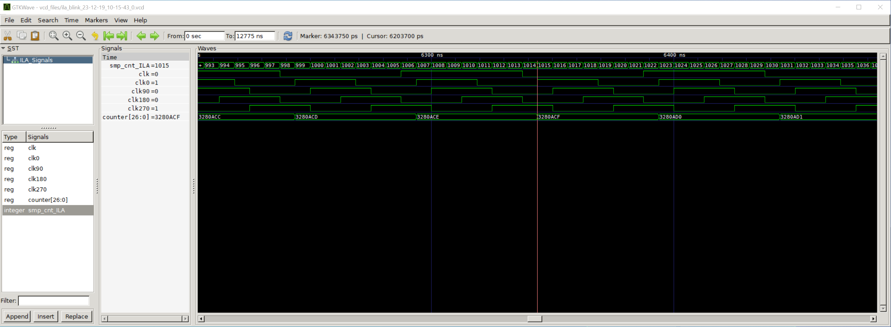

# Integrated logic analyser (ILA) for the GateMate FPGA from Cologne Chip
With the ILA, you can perform in-system debugging of your designs on the GateMate FPGA during runtime. It allows you to capture and analyze all signals of your design as a waveform directly within the FPGA, while it is configured with your design. This means, for example, that you can monitor complex data flows in real-time and troubleshoot errors efficiently without disrupting the normal operation of your system.

## Benefits of the ILA

- Simultaneously analyze over 1000 bits from all signals in your Device Under Test (DUT).
- A simple, interactive, self-explanatory shell that will guide you through the configuration process of the ILA.
- Analyze signals from your design directly within the FPGA in a waveform format, similar to simulations, using the original names and vector sizes from your design.
- Configure a custom bit pattern as a trigger across the full range of signals you wish to analyze, utilizing '1' for high, '0' for low, and 'DC' (Don't Care) for any bit, to precisely target specific conditions or scenarios.
- Utilize the maximum available RAM to extend capture time.
- Set a specific duration time before and after triggering to capture the statistics of your signals within the time frame of interest.
-	Control the reset state of your DUT from the ILA in real-time, enabling you to initiate a capture right from the startup of the DUT.
- Easily redefine a trigger or a range of triggers to automatically initiate multiple captures in sequence.
- Set the trigger to detect either a rising or falling edge on the specific signal that interests you.
- Reconfigure the ILA by adjusting and invoking a JSON file generated by the ILA control program (ILAcop).

## Table of contents
- [Prerequisites](#prerequisites)
- [Installation](#installation)
  - [Python 3 installation](#python-3-installation)
  - [Installation of ILA](#installation-of-ila)
    - [Repository structure](#repository-structure)
  - [Installation of external python packages](#installation-of-external-python-packages)
  - [Installation of a wave viewer](#installation-of-a-wave-viewer)
    - [GTKWave](#gtkwave)
    - [Other wave viewers](#other-wave-viewers)
  - [Note for use in wsl](#note-for-use-in-wsl)
  - [Define Linux access rules for USB](#define-linux-access-rules-for-usb)
- [Basic ILA setup](#basic-ila-setup)  
  - [Access to external software](#access-to-external-software)
  - [Setting Up Communication with External Hardware](#setting-up-communication-with-external-hardware)
- [Hardware setup](#hardware-setup)
- [ILA functionality](#ila-functionality)
  - [Trigger condition](#trigger-condition)
  - [Signal analysis](#signal-analysis)
  - [Frequency analysis](#frequency-analysis)
  - [Capture duration](#capture-duration)
  - [User controllable reset](#user-controllable-reset)
- [Usage](#usage)
  - [ILAcop parameters and options](#ilacop-parameters-and-options)
    - [Change external clock frequency](#change-external-clock-frequency)
    - [Phase shift](#phase-shift)
    - [Optimize DUT](#optimize-dut)
    - [Change work dir](#change-work-dir) 
    - [Clean](#clean)
    - [Synchronise signals under test](#synchronise-signals-under-test)
  - [Configuration with the interactive shell](#configuration-with-the-interactive-shell) 
  - [Create JSON](#create-json)
  - [Reconfiguaration of the ILA using a JSON File](#reconfiguaration-of-the-ila-using-a-json-file)
  - [Restart control of the ILA on the FPGA at runtime](#restart-control-of-the-ila-on-the-fpga-at-runtime)
  - [Example of configuration with the interactive shell](#example-of-configuration-with-the-interactive-shell)
  - [Control the ILA on the FPGA during runtime using the blink example](#control-the-ila-on-the-fpga-during-runtime-using-the-blink-example)
    - [Setting a trigger](#setting-a-trigger)
    - [Start capture](#start-capture) 
    - [Reset ILA](#reset-ila)
    - [Reset DUT](#reset-dut)
    - [Exit](#exit)
    - [Setting a sequence of triggers](#setting-a-sequence-of-triggers)
  - [JSON File](#json-file)
- [License](#license)

## Prerequisites

The ILA can be used in conjunction with the GateMate FPGA. The digital circuit of the ILA was designed
in the hardware description language Verilog. A Python program controls the configuration of the ILA
with the design under test (DUT) and the communication, as well as the interaction between FPGA and
user during the debugging process. 

`Python3` with additional packages is required for the execution of user
software. Further software, such as the GateMate FPGA toolchain and GTKWave, is also required to execute
the ILA.

:point_up: **Please Note!** It is assumed in this document
1. that the reader has developed an FPGA design and wants to use it on the GateMate FPGA.
2. that the use of the GateMate FPGA, along with Yosys and Place & Route, is well-known, and the customer's design has already been loaded into the FPGA using the GateMate toolchain. Otherwise, check the dokument [Toolchain Installation User Guide.](https://www.colognechip.com/docs/ug1002-toolchain-install-latest.pdf)

The ILA can be used both with the GateMate FPGA Evaluation Board and with the customer's own hardware.

- If the GateMate FPGA Evaluation Board is being used, familiarity with the [Evaluation Board Datasheet](https://www.colognechip.com/docs/ds1003-gatemate1-evalboard-latest.pdf) is assumed.
- If customer hardware is used, please note that the ILA requires a USB interface between
the computer and the GateMate FPGA. The FPGA ultimately uses an SPI interface
to communicate with the PCB circuitry. The USB-to-SPI adapter can either be built
on the customer PCB or the GateMate FPGA Programmer can used and connected to the FPGA. Please see [Programmer Board Datasheet] (https://www.colognechip.com/docs/ds1002-gatemate1-programmer-latest.pdf) for more information.

## Installation

### Python 3 installation
Python3 is required to use the ILA Control Program (ILAcop). It is recommended to use at least Python 3.8.

On most Linux systems, `python3` can be installed from the package management software.

For example, users of Debian-based Linux distributions can use the `Advanced Package Tool`:
<pre>
$ > sudo apt-get update
$ > sudo apt install python3
</pre>
Windows users can also install `python3` from the official Microsoft Store. 

More information about the installation of `python3` can be found at: https://www.python.org/downloads/. 

### Installation of ILA
Please download the software from https://github.com/colognechip/gatemate_ila.git into a directory of your choice.

It is recommended to use Git to easily keep the software up to date. For information on how to install Git, check https://github.com/git-guides/install-git.

Example of how to install Git on Linux using apt:
<pre>
$ > sudo apt-get install git
</pre>
Once Git is installed, the following command can be used to clone the Git repository:
<pre>
$ > git clone https://github.com/colognechip/gatemate_ila.git
</pre>

You should now have the source files from the `gatemate_ila` in your working directory, with the following structure:

#### Repository structure

In the following the files of the  ILA and their functions are explained:
- **app:**  
  This folder contains all the files required to run the user application ILAcop.
  -  *ILAcop.py:*  
    This file is the main script from which a user starts the ILAcop. The script handles the passed parameters and starts the processes requested by the user. More information about usage in chapter [Usage](#usage).
  - *config.py:*  
    Here, you can configure the ILA and the tools utilized by it. For more informations see [ILAcop parameters and options](#ilacop-parameters-and-options).
  - *requirements.txt:*  
    This file contains all the Python packages used by the ILAcop. It can be used to install the packages using pip.  For more informations see[Installation of external python packages](#installation-of-external-python-packages) 
  - **save\_config:**  
    All created configurations of the ILA are stored in this folder as a JSON File. The ILA can be configured and stared with the help of this files. The files contain all configurations in plain text and can be edited by the user. More Informations in [Reconfiguaration of the ILA using a JSON File](#reconfiguaration-of-the-ila-using-a-json-file)
  - **vcd\_files:**  
    This folder contains the vcd files created by the ILAcop. The VCD files describe the waveforms of the analyzed signals and can be opened with a waveform viewer like GTKWave.
  - *ILAConfig.py:*  
    This file contains the `ILAConfig` class, which includes all methods for configuring the gateware of the ILA before starting the implementation.
  - *RuntimeInteractionManager.py:*  
    This file implements the `RuntimeInteractionManager` class, which contains all the methods through which the user can communicate with the ILA while the ILA is running on the FPGA.
  - *communication.py:*  
    This file contains the `Communication` class, which controls the Serial Peripheral Interface (SPI) to the ILA.
  - *last\_upload.txt:*  
    This file contains the last configuration of the ILA transferred to the FPGA. With this information, communication with the ILA can be restarted using the last uploaded config.
  - **config\_design:**  
    During the configuration of the ILA, the software creates an edited version of the DUT gateware. These Verilog files are stored in this folder. 
- **example_dut:**  
  In this folder, there are two example designs that demonstrate the functionality of the ILA and can be used for understanding. In the folders of the respective examples **blink** and **gol_image_test_vhdl** you will find further explanations of the design and test procedure.
- **src:**  
  This folder contains the verilog source files of the ILA
- **sim:**  
  This folder contains the test bench, which can be used to simulate the gateware of the ILA.
- **log:**  
  This folder contains the log files generated by `yosys` and `p\_r` when bringing the gateware of both the ILA and DUT to the FPGA.
- **net:**  
  This folder contains the verilog netlist of the gateware of the ILA and DUT generated by `yosys`.
- **p\_r\_out:**  
  This folder contains all files generated by `p\_r` including the post-synthesis netlist of the gateware of both the ILA and DUT. 
- *LICENSE:*  
  The *LICENSE* file specifies the legal terms under which the contents of the repository can be used, modified, and distributed.

### Installation of external python packages
The ILA file app/requirements.txt contains a list of external Python packages that
are required for the execution of ILAcop. These packages are:
- numpy
- pyftdi
- pyvcd
- prettytable

One way to install the requirement is to use the python package management software `pip`. 

If pip is not present, in some Python versions the module ensurepip is available, which
can be used to install or upgrade pip:
<pre>
$ > python3 -m ensurepip --upgrade
</pre>
Or alternatively, pip can be installed via the operation system package management software. For Debian-based Linux distributions:
<pre>
$ > sudo apt install python3-pip
</pre>

Further information about the installation can be found on: https://pip.pypa.io/en/stable/installation/ 

In the application folder you will find a file named `app/requirements.txt` which allows you to install all required packages with the command:
<pre>
$ > pip3 install -r requirements.txt
</pre>

### Installation of a Wave Viewer

To view the waveform of the signals being analyzed, you need a waveform viewer that is able to:
- Open .vcd files.
- Be callable from the terminal.

#### GTKWave

A very common wave viewer is GTKWave. On Debian-based Linux distributions you can
use the package management software for installation:
<pre>
$ > sudo apt install gtkwave
</pre>
Windows users can download `GTKWave` in a zip file from https://sourceforge.net/projects/gtkwave/files/. 

Extract the files into a folder of your choice. Inside the folder, you will find a `bin` folder with the `gtkwave.exe` file inside. Add the `bin` folder to your system path.

#### Other Wave Viewers

Other wave viewers can also be used if they fulfill the requirements mentioned above. The call of the corresponding programme must be adapted accordingly in the `app/config.py` file:
<pre>
REPRESENTATION_SOFTWARE = ['gtkwave']
REPRESENTATION_FLAGS = ['--save', 'save.gtkw']
</pre>

When customising the call, please note that the software places the vcd file in the call between the `REPRESENTATION_SOFTWARE` and the `REPRESENTATION_FLAGS`.

### Note for use in wsl 

To effectively utilize the ILA (Integrated Logic Analyzer) software within the Windows Subsystem for Linux (WSL), it is recommended to use Linux-compatible tools exclusively. This ensures seamless operation and compatibility within the WSL environment. Additionally, it's important to have the FTDI (Future Technology Devices International) connection available in WSL. This can be achieved by using the USBIPD-WIN project, which enables USB device sharing between Windows and WSL. For detailed instructions on setting this up, please refer to the official documentation at https://learn.microsoft.com/de-de/windows/wsl/connect-usb. This guide provides essential information on connecting USB devices to WSL, ensuring full functionality of the ILA software in this environment.

### Define Linux access rules for USB

To ensure your Python program or the PyFTDI library has access to USB-Serial devices in Ubuntu, you can create a UDEV rule to set the necessary permissions. This involves editing the `/etc/udev/rules.d/99-usb-serial.rules` file. Follow these steps:

1. Edit the UDEV Rules File:
  Open the file for editing using the command:
  <pre>
  sudo nano /etc/udev/rules.d/99-usb-serial.rules
  </pre>

2. Find `idVendor` and `idProduct` of your Device:
  <pre>
  > lsusb
  Bus 001 Device 003: ID 0403:6010 Future Technology Devices International, Ltd FT2232C/D/H Dual UART/FIFO IC
  </pre>
  In this example, 0403 is the idVendor and 6010 is the idProduct.

3. Add a UDEV Rule:
  Add a rule to set permissions for the device. For example:
  <pre>
  SUBSYSTEM=="usb", ATTRS{idVendor}=="0403", ATTRS{idProduct}=="6010", MODE="0666"
  </pre>
  - SUBSYSTEM=="usb" targets USB devices.
  - ATTRS{idVendor}=="0403", ATTRS{idProduct}=="6001" specifies the device using its vendor and product IDs. Replace these with the actual IDs of your USB-Serial device, which you can find using lsusb.
  - MODE="0666" sets the permissions to read and write for everyone. This is suitable for development but considersecurity implications for production environments.

4. Save and Exit:  
  Save the file and exit the editor (Ctrl + X, then Y, and Enter in Nano).

5. Reload UDEV Rules:  
  After adding the rule, reload the UDEV rules to apply the changes:
  <pre>
  sudo udevadm control --reload-rules
  sudo udevadm trigger
  </pre>

This should set the permissions for your USB-Serial device, allowing your Python program and the PyFTDI library to access it.
  

## Basic ILA setup

The ILA is by default set up for use with the evaluation board from Cologne Chip. If you are using different hardware, such as the GateMate Programmer, you will need to modify some basic ILA settings. 

In the app/config.py file, you can configure settings for the toolchain and hardware being used.

### Access to external software

The ILAcop has to execute the toolchain applications and GTKWave. 

If you haven't already done so, install the GateMate FPGA toolchain to transfer your design to the GateMate FPGA. You can follow the [Toolchain Installation User Guide.](https://www.colognechip.com/docs/ug1002-toolchain-install-latest.pdf)

The ILAcop must be able to call the execution files from the system path. Ensure that your system can recognize
the following application calls from the system path by using the command line interface:
<pre>
$ > yosys
$ > p_r
$ > openFPGALoader
$ > gtkwave
</pre>
If a command is not found, its path must be entered in the system settings.

Alternatively, you can add the absolute PATH of the respective program to be executed in the `app/config.py` file. This ILA setup file contains some main
settings.

For example, the file could be changed as follows:
<pre>
YOSYS = '/home/dave/cc-toolchain-linux/bin/yosys/yosys'
YOSYS_FLAGS = '-nomx8'
PR = '/home/dave/cc-toolchain-linux/bin/p_r/p_r'
PR_FLAGS = '-cCP +uCIO' # The +uCIO flag must not be removed. The ccf file is automatically appended
UPLOAD = '/home/dave/cc-toolchain-linux/bin/openFPGALoader/openFPGALoader'
UPLOAD_FLAGS = ' -b gatemate_evb_spi -f --verify '
REPRESENTATION_SOFTWARE = '/home/dave/gtkwave/bin/gtkwave'
REPRESENTATION_FLAGS = ['--save', 'save.gtkw']
CON_DEVICE = 'evb' # GateMate Evaluation Board = 'evb', GateMate Programmer = 'pgm' 
CON_LINK = 'ftdi://ftdi:2232h/1' # evb = 'ftdi://ftdi:2232h/1', pgm = 'ftdi://ftdi:232h/1'
</pre>

You can also set flags for `yosys` and `p\_r` in the *config.py* file.
<pre>
YOSYS = 'yosys'
YOSYS_FLAGS = '-nomx8'
PR = 'p_r'
PR_FLAGS = '-cCP +uCIO' # The removal of the +uCIO flag is not permissible. The ccf file is automatically appended
</pre> 

The command `+uCIO` switches the configuration GPIO bank of the FPGAS so that these can be used as normal user IOs. This is necessary for the ILA to be able to communicate via the same connection as it was configured.

If you have selected other IOs for the SPI communication of the ILA gateware, the '+uCIO' flag can also be omitted.

### Setting Up Communication with External Hardware

The software for the configuration of the GateMate FPGA, as well as the respective programming mode, can be customised in `app/config.py` under the following constants:

<pre>
UPLOAD = 'openFPGALoader'
UPLOAD_FLAGS = ' -b gatemate_evb_jtag '
</pre>
  
If you use the evaluation board, check if the correct programming mode has been selected on the Board. The program is defaulted to the GateMate evaluation board and configures it directly via jtag.

The programming mode options for the openFPGALoader can be found under: https://trabucayre.github.io/openFPGALoader/vendors/colognechip.html.

The gateware of the ILA communicates with the ILAcop via SPI in passive mode. The hardware connected via USB should therefore be able to establish a SPI communication.

In the `app/config.py` file are predefined configurations for the original [evaluation board](https://colognechip.com/docs/ds1003-gatemate1-evalboard-latest.pdf) and the original [GateMate programmer](https://colognechip.com/docs/ds1002-gatemate1-programmer-latest.pdf) from Cologne Chip.

The configurations are set by default on the evaluation board. To set these on the programmer, the following constants must be changed accordingly:

<pre>
UPLOAD_FLAGS = ' -b gatemate_pgm'
CON_DEVICE = 'pgm'
CON_LINK = 'ftdi://ftdi:232h/1'
</pre>

If your own hardware is used, the constants must be adjusted accordingly.

If your own hardware has level shifters before the FPGA, which are activated via the IOs of an FTDI, the following parameters must also be adjusted:
<pre>
CON_DEVICE = 'cust'
cust_gpio_direction_pins = 0x17F0
cust_gpio_direction = 0x1710
cust_gpio_write = 0x0210
</pre>
If no level shifter needs to be activated, set `CON_DEVICE = 'free'`.

The pins used by the SPI-passive controller of the gateware to communicate with the ILA cop can be adjusted in the file `src/ILA_top.ccf` and are located by default at the pins:
<pre>
Pin_in   "i_sclk_ILA"     Loc = "IO_WA_A5" | SCHMITT_TRIGGER=true;   
Pin_in   "i_mosi_ILA"  	  Loc = "IO_WA_A4";
Pin_out  "o_miso_ILA"     Loc = "IO_WA_B3";
Pin_in   "i_ss_ILA"  	    Loc = "IO_WA_B4";
</pre>

If you want to see all the connected Links on your PC, you can do this in the **app** folder by the following program call:
<pre>
python3 .\ILAcop.py --showdev
</pre>
All available interfaces are displayed as follows:
<pre>
Available interfaces:
	ftdi://ftdi:2232:E1-31B0220/1   (GateMate FPGA Evalboard 3.1B)
	ftdi://ftdi:2232:E1-31B0220/2   (GateMate FPGA Evalboard 3.1B)
</pre>

In this case, the dual port FTDI of the GateMate evaluation board is displayed.

If you want to change the SPI frequency for the communication of the ILA, you need to modify the following line in the `app/config.py` file:
<pre>
freq_max = 10000000   
</pre>

## ILA functionality

### Trigger condition

ILA has two ways of specifying a trigger condition:
- Any signal can be used as a trigger on its falling or rising edge.
- In addition, any number of signals can be selected and a pattern comparison triggers the measurement when all selected signals have reached the previously defined value.

The trigger condition is specified in the interactive shell before the DUT gets active. It can
be changed, stopped or re-activated during runtime by the user.

When the trigger has fired, the data recording is executed and the data is automatically
downloaded to the computer and displayed in the wave viewer. When the data recording is
finished, the trigger is stopped and can (depending on the configuration) be automatically
re-activated after the end of the data transmission. It can be set whether it is the same
trigger condition or a different one. A list of trigger conditions can be entered, which is
processed one after the other. At the end of the list, ILA stops recording data.

With the pattern compare function, a pattern can be applied across the entire width of
the sample, determining the state of each bit. For each individual bit, it can be decided
whether, at the time of triggering, it should be ’1’, ’0’, or ’DC’ (don’t care).

The pattern compare function can only be set with a sample width of 5 bits or more.

The pattern compare function can be switched on or off when configuring the ILA. If the function is switched off, it is not available for the user at runtime.
If this function is activated, more hardware is required for the ILA gateware and the maximum possible sampling frequency may be reduced.

### Signal analysis

The user can select more than 1000 bits from the signals in the DUT to be analyzed, depending on the RAMs in use by the DUT.

The ILAcop tool automatically identifies the signals from the specified Device Under Test (DUT). Users simply need to select the signals under test from a provided table. Additionally, it is possible to filter the signals based on the modules in which they are found.

The Signals can be individual signals or signal vectors.
It is also possible to select only partial sections of signal vectors. All selected signals are combined in a sample.

To select a specific range of a vector, specify two natural numbers representing the bit positions. These numbers must lie within the valid range of the vector. The order in which you specify these numbers should correspond to the vector's definition. For instance, if the vector is defined as `a[15:0]`, select the range with the higher value first, e.g., `10:3`. For a vector like `b[0:15]`, the order would be reversed, e.g., `3:10`. Choose your indices in accordance with the vector's definition:

Individual signals are simply indicated with the respective index. Several individual signals and ranges can also be specified in combination. For this, the indexes and ranges must be separated with a comma. 

For example: `12, 10:8, 4, 2:0`.

### Frequency analysis

The sampling frequency determines the delay between stored samples. For analysis frequency, a user can choose a clock signal generated by a PLL from the DUT, an external clock signal, or instantiate an additional PLL using an external clock signal with a frequency freely selected by the user.

ILAcop automatically identifies all PLLs instantiated in the design and displays them along with their output frequencies and signals. Users can choose from the three options defined above. ILAcop also automatically detects external clocks. Usually, the same clk signal that clocks the tested signals suffices.

If you wish to instantiate an additional PLL, please consider the following guidelines:

- The sampling frequency is recommended to be up to 140MHz, depending on the configuration and the total hardware in use.
- It is advisable for the sampling frequency to be equal to or an integer multiple of the frequency at which the signals under test change their state.

Please note: The higher the sampling frequency, the shorter the time period that can be captured in a single shot, as the random-access memory (RAM) fills up more quickly.

### Capture duration
During the ILA's capture process, the samples are stored to the internal block RAMs of the GateMate FPGA for each clock period of the analysis frequency. 
The maximum capture duration depends on the available ram, the width of the sample and the sampling frequency. 

The program determines how much RAM memory is occupied by the DUT. To calculate the free RAM available for the ILA, the RAM occupied by the DUT is subtracted from the total available RAM.

The total number of available RAMs is defined in the `app/config.py` file.
<pre>
available_BRAM = 60 # 20k RAM blocks
</pre>

You have to define two values:

##### capture duration before trigger
This parameter sets the capture duration before the trigger is activated.
##### capture duration after trigger
This parameter sets the capture duration after the trigger is activated.

### User controllable reset

The ILAcop allows for control of a reset signal from the DUT (Device Under Test). This enables manual activation or deactivation of the reset. When the user initiates the capture process, the reset is automatically deactivated. This feature allows users to analyze the start process of the DUT immediately after a reset.

Attention: The ILA treats the signal as active LOW.

For the reset signal, users can either utilize an external reset signal or the output signal from the CC_USR_RSTN primitive in their design. The functionality of the CC_USR_RSTN primitive remains intact

## Usage

### ILAcop parameters and options

To start the ILAcop, you have to execute the *ILAcop.py* script in the **app** folder.

Make sure the program has rights to access the USB port the FPGA is connected to. For Linux System see [Define Linux access rules for USB](#define-linux-access-rules-for-usb).

With the following command, you can get an overview of the parameters with which the program can be called:
<pre>
gatemate_ila\app> python3 ILAcop.py --help
usage: ILAcop.py [-h] [--version] [--clean] [--showdev] [-wd WORK_DIR] {config,start,reconfig} ...

GateMate ILA control program. With this script, you can configure and execute the ILA with a design under test (DUT).

options:
  -h, --help            show this help message and exit
  --version             show program's version number and exit
  --clean               Deletes all output files created by the program.
  --showdev             Outputs all found FTDI ports.
  -wd WORK_DIR          Folder from which Yosys should be started for the synthesis of the Design Under Test.

main_actions:
  {config,start,reconfig}

example usage:
python3 ILAcop.py [Commands]

Commands:
  config:   Configure the ILA. the following options must be included:
             -vlog SOURCE    Paths to the Verilog source code files.
             -vhd SOURCE     Paths to the VHDL source code files.
             -t NAME         Top level entity of the design under test.
             -ccf SOURCE     Folder containing the .ccf file of the design under test.
             -f MHz          Defines the external clock frequency in MHz (default is 10.0 MHz).
             -sync LEVEL     Number of register levels via which the SUT are synchronised.
             -d DELAY        ILA PLL Phase shift of sampling frequency. 0=0°, 1=90°, 2=180°, 3=270° (default: 2).
             -opt            Optimizes the design by deleting all unused signals before design evaluation.
          (optional) Subcommands config:
                -create_json: Creates a JSON file in which the logic analyzer can be configured.
            NOTE: Without the subcommand the configurations are requested step by step via the terminal.

  reconfig: Configures the ILA based on a JSON file. With this option you have to specify a JSON file with -l [filename].json.

  start     Starts the communication to the ILA with the last uploaded config

</pre>

#### Change external clock frequency 
The value for the external frequency can be changed with the flag `-f`.
The frequency is defined in MHz as a floating-point value. The default value is `10.0` MHz.
#### Phase shift
With the parameter `-d` you can set the phase shift of the sampling frequency `0 = 0°, 1 = 90°, 2 = 180° and 3 = 270°`. By default, the phase shift of the sampling frequency is set to `2 = 180°`.
When evaluating the captured samples, it must be taken into account that each PLL has its own digitally controlled oscillator (DCO), which oscillates independently. The exact sampling point can therefore vary within the period of a selected sampling frequency. However, the user is able to shift the sampling frequency by 90, 180 or 270 degrees in order to shift the sampling point. 
For example: A sampling frequency of 80 MHz results in a period of 12.5 ns. The sample point can be shifted in four 3.125 ns steps. 

#### Optimize DUT

Passing the `-opt` parameter causes an optimization of the DUT before the ILAcop searches for signals to be tested. This process removes unused signals, which will not be displayed.

#### Change work dir

If there is an indirect path within your design, for example a call like `initial $readmemh("mem/mem.hex", memory);`, please enter the root directory from which the file is referenced with the flag -wd <WORK_DIR>.

#### Clean 

The --clean parameter ensures that all files created by the ILAcop are deleted.

<pre>
gatemate_ila\app> python3 ILAcop.py --clean
All files in directory ../net/ deleted.
All files in directory ../log/ deleted.
All files in directory save_config/ deleted.
All files in directory ../p_r_out/ deleted.
All files in directory vcd_files/ deleted.
All files in directory config_design/ deleted.
</pre>

### Synchronise signals under test

With the parameter '-sync LEVEL', you can set the number of registers through which all SUTs are synchronized before being transferred to the internal memory. Values greater than or equal to 0 are permitted. 

### Configuration with the interactive shell

In the following example, the interactive shell is started to configure the ILA with a DUT step by step:
<pre>
$ > python3 ILAcop.py config -vlog &lt;your_design_src&gt; -t &lt;top_level_entity&gt;
</pre>

You can pass Verilog source code using the `-vlog` flag and VHDL source code using the `-vhd` flag to reference the source code of the DUT. Using the flag, provide one or more paths to directories containing the respective source code files. The program will search for all Verilog or VHDL files and build the design.

The agument `-t` must be used to specify the top level entity of the DUT.

If the constraints  file is not in the same folder as the given source code, you also have to add a folder with the `.ccf` file of your design with the flag `-ccf`.

### Create JSON

It is also possible to create a JSON file with a DUT, from which configurations such as the signals under test and the sampling frequency can be set.

<pre>
$ > python3 ILAcop.py config -vlog &lt;your_design_src&gt; -t &lt;top_level_entity&gt; -create_json
</pre>

In the generated JSON file, at least the sampling frequency in MHz must be entered as a decimal number with a dot separator, formatted as a string, and at least one signal must be selected for analysis. More information about the JSON file in: [JSON File](#json-file).

### Reconfiguaration of the ILA using a JSON File

Every time the ILA was configured with the interactive shell, the configuration is stored in a JSON file. You are able to edit the file and reconfigure the ILA with the configurations defined inside the JSON file. 

With the following command, the ILA can be reconfigured using the JSON file:
<pre>
$ > python3 ILAcop.py reconfig -l ila_config_name_year_month_day_hour_minute_second.json
</pre>

If a reconfiguration is performed, the capture duration before and after trigger must be redefined, because the capture times may change due to changes in the signals and frequency to be analysed.
More information about the JSON file in: [JSON File](#json-file).

### Restart control of the ILA on the FPGA at runtime
The communication with the ILA can be restarted at any time after it has been terminated with the following command:
<pre>
$ > python3 ILAcop.py start 
</pre>
The user software remembers the last configuration of the FPGA, reconfigures the FPGA, and starts communication with the gateware of the ILA.

### Example of configuration with the interactive shell

This section provides step-by-step instructions on configuring ILA using the interactive shell, illustrated with example outputs from the ILAcop interactive shell.

First, the program displays the found constraints file and all source code files from the DUT.

<pre>
gatemate_ila\app> python3 ILAcop.py config -vhd ..\example_dut\ws2812_gol\src -t ws2812_gol

################ ccf File ##################
#                                           #
# ws2812_gol.ccf                            #
#                                           #
#############################################

################ vhdl Files #################
#                                           #
# aserial.vhd                               #
# edge_detection.vhd                        #
# gol_8x8_control.vhd                       #
# gol_cell.vhd                              #
# init_package.vhd                          #
# ram.vhd                                   #
# ram_to_bit.vhd                            #
# receive_command.vhd                       #
# spi_slave.vhd                             #
# ws2812_gol.vhd                            #
#                                           #
#############################################

</pre>

The DUT is analyzed by constructing it from the provided sources, enabling the identification of signals, PLLs, Block-RAMs, and the CC_USR_RSTN primitive. All detected elements are outputted to the interactive shell.

<pre>

Examine DUT ...

################ RAM in use #################
#                                           #
# CC_BRAM_20K in use: 1                     #
# CC_BRAM_40K in use: 0                     #
#                                           #
#############################################

############ Found PLL instance #############
#                                           #
# Pll name  = pll_inst_1                    #
# Frequency = 12.5 MHz                      #
# CLK0      = clk0_1                        #
# CLK180    = clk180_1                      #
# CLK270    = clk270_1                      #
# CLK90     = clk90_1                       #
#                                           #
#############################################

############# Found user reset ##############
#                                           #
# Reset signal name = rst                   #
#                                           #
#############################################

</pre>

Subsequently, the user is guided through the configuration of the ILA. Entering 'e' exits the process and generates a configurable JSON file for the specified DUT with all the configurations made, allowing the user to made configurations directly within the file and set up the ILA directly from the file. For more Information see [Reconfiguaration of the ILA using a JSON File](#reconfiguaration-of-the-ila-using-a-json-file).
At any point, the user can enter 'p' for 'previous' to backtrack a step. Initially, the user must select a clock source for the DUT. Usually, the same clk signal that clocks the tested signals is sufficient.

Typically, there are always two options available:

1.  Use an external clk input signal.
2.  Use an additional PLL with a freely selectable frequency (requires additional net of the global mesh).

If the ILAcop detects a PLL in the DUT, a third option becomes available:
3. Use a signal generated by a PLL from your design.

If you use a clock signal that also clocks the signals under test, no additional net of the global mesh is needed.

Attention! The GateMate A1 FPGA has four nets in its global mesh. If all four are already used by the DUT, one of these signals must be used for the ILA.

Since each PLL has four output frequencies, if a user wants to choose a PLL for the ILA frequency from their own design, no additional global net is required only if the same signal used in the design is selected.

<pre>

!!!!!!!!!!!!!!!!!!!!!!!!!!!!! NOTE !!!!!!!!!!!!!!!!!!!!!!!!!!!!!
!                                                              !
! Now you will be guided through the configuration of the ILA. !
! Entering 'e' exits the process and generates a configurable  !
! JSON file for the given DUT.                                 !
! Enter 'p' for 'previous' to backtrack a step.                !
!                                                              !
!!!!!!!!!!!!!!!!!!!!!!!!!!!!!!!!!!!!!!!!!!!!!!!!!!!!!!!!!!!!!!!!

!!!!!!!!!!!!!!!!!!!!!!!!!!!!!!!!! NOTE !!!!!!!!!!!!!!!!!!!!!!!!!!!!!!!!!!
!                                                                       !
! In the following, a clock source for the ILA should be selected.      !
! Usually, the same clk signal that clocks the tested signals suffices. !
!                                                                       !
!!!!!!!!!!!!!!!!!!!!!!!!!!!!!!!!!!!!!!!!!!!!!!!!!!!!!!!!!!!!!!!!!!!!!!!!!

Here are the possible ways to provide a clock to the ILA:

 1 = Use an external clk input signal.
 2 = Use an additional PLL with a freely selectable frequency (additional net of the global Mesh are required).
 3 = Use a signal generated by a PLL from your design.
 
please choose between 1 and 3: 3

########### PLL instances signals ###########
#                                           #
# pll_inst_1: 12.5 Mhz                      #
#                                           #
#  0 = clk0_1                               #
#  1 = clk180_1                             #
#  2 = clk270_1                             #
#  3 = clk90_1                              #
#                                           #
# pll_inst_2: 25.0 Mhz                      #
#                                           #
#  4 = clk0_2                               #
#  5 = clk180_2                             #
#  6 = clk270_2                             #
#  7 = clk90_2                              #
#                                           #
# pll_inst_3: 50.0 Mhz                      #
#                                           #
#  8 = clk0_3                               #
#  9 = clk180_3                             #
#  10 = clk270_3                            #
#  11 = clk90_3                             #
#                                           #
# pll_inst_4: 100.0 Mhz                     #
#                                           #
#  12 = clk0_4                              #
#  13 = clk180_4                            #
#  14 = clk270_4                            #
#  15 = clk90_4                             #
#                                           #
#                                           #
#############################################

Attention! If you choose an output signal of a PLL that you will not use in your design, an additional net of Global Mesh is required!

Choose a clock signal: 12

</pre>

If an additional PLL is instantiated, or if the user wishes to select an external clock signal as the analysis frequency, an external clock signal must be chosen. The program automatically attempts to find the DUT's clock input sources using keywords. The first input signal with `clk` or `clock` in its name is automatically set as the clk-source. This is to ensure the program has identified the correct signal as the clock source. If not, the user must press y and select the clock source from all found input ports of the top level DUT.

Additionally, when a PLL is instantiated, the user is prompted to enter an analysis frequency.

<pre>
Here are the possible ways to provide a clock to the ILA:

 1 = Use an external clk input signal.
 2 = Use an additional PLL with a freely selectable frequency (additional net of the global Mesh are required).
 3 = Use a signal generated by a PLL from your design.

 Please choose between 1 and 3: 2

########### found DUT clk source ############
#                                           #
# Input serves as ILA clk source: "clk"     #
#                                           #
#############################################

Do you want to change the clk source? (y:yes/N:no):

!!!!!!!!!!!!!!!!!!!!!!!!!!!!!!!!!!!!!! Note !!!!!!!!!!!!!!!!!!!!!!!!!!!!!!!!!!!!!!!
!                                                                                 !
! The sampling frequency determines the rate at which signals are captured.       !
! When selecting the frequency, ensure it is harmonious with the DUT's frequency, !
!  either matching or an integral multiple.                                       !
! Recommended max. sampling frequency up to 160MHz.                               !
!                                                                                 !
!!!!!!!!!!!!!!!!!!!!!!!!!!!!!!!!!!!!!!!!!!!!!!!!!!!!!!!!!!!!!!!!!!!!!!!!!!!!!!!!!!!

Choose a sampling frequency (greater than 0, float, in MHz): 120

</pre>

A user can activate and deactivate the reset of the DUT while the ILA is running.
Therefore the programme first searches for the primitive `CC_USR_RSTN`. For more information about the primitive see: [GateMate FPGA User Guide Primitives Library](https://www.colognechip.com/docs/ug1001-gatemate1-primitives-library-latest.pdf). 

If the primitive is found, its output signal is linked to the reset control signal of the ILA so that this signal can be controlled by the user in the menu of the ILAcop at runtime.   

If the primitive is not found, an external reset input is searched for. The key words `'rst', 'res'` are used to search for an input name that contains this substring.

If no signal for reset was found automatically, the user can either define a signal manually or select no signal, in this case the function is not available for the user.

<pre>

!!!!!!!!!!!!!!!!!!!!! User controllable reset !!!!!!!!!!!!!!!!!!!!
!                                                                !
! The ILA can hold the DUT in reset until capture starts.        !
! This makes it possible to capture the start process of the DUT !
! Attention, the ila treats the signal as active LOW.            !
!                                                                !
!!!!!!!!!!!!!!!!!!!!!!!!!!!!!!!!!!!!!!!!!!!!!!!!!!!!!!!!!!!!!!!!!!

The following options are available:

 1 = Use an external reset input signal.
 2 = Deactivate this function.
 3 = Use the ouput signal from the CC_USR_RSTN primitive in your design. Found signal: 'rst' (The functionality of the CC_USR_RSTN primitive is still given).

Please choose between 1 and 3: 3

</pre>

Next, all signals found in the DUT are listed, and the user is prompted to select the signals they wish to analyze. By entering `f`, the signals can be filtered according to the modules in which they were found. Entering `0` notifies the system that all signals for analysis have been selected.

Signals that have been chosen are now marked accordingly in the output list. The ['A'] stands for `all` and indicates that the entire vector is being analyzed. If only a specific range has been selected, this will be displayed accordingly in the 'selected' row.

<pre>
!!!!!!!!!!!!!!!!!!!!!!!!!!!!!!!!!!!!!!!!!!!!!! NOTE !!!!!!!!!!!!!!!!!!!!!!!!!!!!!!!!!!!!!!!!!!!!!!!
!                                                                                                 !
! You will be prompted to select signals for analysis from those found in your design under test. !
!                                                                                                 !
!!!!!!!!!!!!!!!!!!!!!!!!!!!!!!!!!!!!!!!!!!!!!!!!!!!!!!!!!!!!!!!!!!!!!!!!!!!!!!!!!!!!!!!!!!!!!!!!!!!

--------------------------------- ws2812_gol ----------------------------------
+------+----------------------+---------+----------+--------------------------+
|    # | name                 |  range  | selected | hierarchy                |
+------+----------------------+---------+----------+--------------------------+
|    1 | byte_receive         |  [7:0]  |    []    |                          |
|    2 | byte_send            |  [7:0]  |    []    |                          |
|    3 | clk                  |    1    |    []    |                          |
...
|   38 | gol_init             |    1    |    []    | \golx64.                 |
|   39 | gol_next_gen         |    1    |    []    | \golx64.                 |
|   40 | init_pattern         |  [63:0] |    []    | \golx64.                 |
|   41 | life_out             |  [99:0] |    []    | \golx64.                 |
...
|   46 | rgb_color            |  [1:0]  |    []    | \golx64.                 |
|   47 | shift_life_row       |  [7:0]  |    []    | \golx64.                 |
...
|   59 | ws2812_ram_addr_wr   |  [7:0]  |    []    | \golx64.                 |
...
|   62 | ws2812_rgb_byte_reg  |  [7:0]  |    []    | \golx64.                 |
...
| 1166 | shift_rgb_byte       |  [7:0]  |    []    | \ram_to_bit.             |
...
| 1171 | ws2812_ram_addr_rd   |  [7:0]  |    []    | \ram_to_bit.             |
...
| 1175 | data_out             |    1    |    []    | \ram_to_bit.aserial.     |
...
| 1210 | start_1              |    1    |    []    | \write_bram_rec_cmd.     |
| 1211 | start_2              |    1    |    []    | \write_bram_rec_cmd.     |
+------+----------------------+---------+----------+--------------------------+

## Number of selected bits to be analysed ###
#                                           #
# 0 (max. 1180)                             #
#                                           #
#############################################

Select signals to be analyzed (0 = finish, f = filter): f

--------------------- SUT moduls ----------------------
+----+------------------------------------------------+
|  # | moduls                                         |
+----+------------------------------------------------+
|  0 | ws2812_gol.                                    |
|  1 | ws2812_gol.\dualportram.                       |
|  2 | ws2812_gol.\golx64.                            |
|  3 | ws2812_gol.\golx64.gol_row:1.gol_column:1.gol. |
|  4 | ws2812_gol.\golx64.gol_row:1.gol_column:2.gol. |
...
| 65 | ws2812_gol.\golx64.gol_row:8.gol_column:7.gol. |
| 66 | ws2812_gol.\golx64.gol_row:8.gol_column:8.gol. |
| 67 | ws2812_gol.\ram_to_bit.                        |
| 68 | ws2812_gol.\ram_to_bit.addrcnt.                |
| 69 | ws2812_gol.\ram_to_bit.aserial.                |
| 70 | ws2812_gol.\ram_to_bit.shift_cnt.              |
| 71 | ws2812_gol.\spi_edge_detect.                   |
| 72 | ws2812_gol.\spi_slave.                         |
| 73 | ws2812_gol.\write_bram_rec_cmd.                |
+----+------------------------------------------------+

Select a module from which you would like to analyze signals: 2

---------------- \golx64. signals ----------------
+----+----------------------+---------+----------+
|  # | name                 |  range  | selected |
+----+----------------------+---------+----------+
|  1 | break_counter        |  [23:0] |    []    |
|  2 | clk                  |    1    |    []    |
|  3 | counter_index        |  [3:0]  |    []    |
|  4 | din_spi              |  [7:0]  |    []    |
|  5 | gol_init             |    1    |    []    |
|  6 | gol_next_gen         |    1    |    []    |
|  7 | init_pattern         |  [63:0] |    []    |
|  8 | life_out             |  [99:0] |    []    |
|  9 | life_shift_cnt       |  [2:0]  |    []    |
| 10 | nachbarn             |  [35:0] |    []    |
| 11 | neighbours_in        | [511:0] |    []    |
| 12 | reset                |    1    |    []    |
| 13 | rgb_color            |  [1:0]  |    []    |
| 14 | shift_life_row       |  [7:0]  |    []    |
| 15 | start_sm_new         |    1    |    []    |
| 16 | state_color_to_ram   |  [2:0]  |    []    |
| 17 | tl_gol_state         |  [3:0]  |    []    |
| 18 | waddr_spi            |  [2:0]  |    []    |
| 19 | write_en             |    1    |    []    |
| 20 | write_en_ram         |    1    |    []    |
| 21 | write_en_s           |    1    |    []    |
| 22 | write_ws2812_out     |    1    |    []    |
| 23 | write_ws2812_s       |    1    |    []    |
| 24 | writeram             |    1    |    []    |
| 25 | ws2812_busy          |    1    |    []    |
| 26 | ws2812_ram_addr_wr   |  [7:0]  |    []    |
| 27 | ws2812_ram_addr_wr_s |  [7:0]  |    []    |
| 28 | ws2812_rgb_byte      |  [7:0]  |    []    |
| 29 | ws2812_rgb_byte_reg  |  [7:0]  |    []    |
+----+----------------------+---------+----------+

## Number of selected bits to be analysed ###
#                                           #
# 0 (max. 1180)                             #
#                                           #
#############################################

Select signals to be analyzed (0 = finish, f = no filter, c = change filter): 5

---------------- \golx64. signals ----------------
+----+----------------------+---------+----------+
|  # | name                 |  range  | selected |
+----+----------------------+---------+----------+
|  1 | break_counter        |  [23:0] |    []    |
|  2 | clk                  |    1    |    []    |
|  3 | counter_index        |  [3:0]  |    []    |
|  4 | din_spi              |  [7:0]  |    []    |
|  5 | gol_init             |    1    |  ['A']   |
|  6 | gol_next_gen         |    1    |    []    |
|  7 | init_pattern         |  [63:0] |    []    |
|  8 | life_out             |  [99:0] |    []    |
|  9 | life_shift_cnt       |  [2:0]  |    []    |
| 10 | nachbarn             |  [35:0] |    []    |
| 11 | neighbours_in        | [511:0] |    []    |
| 12 | reset                |    1    |    []    |
| 13 | rgb_color            |  [1:0]  |    []    |
| 14 | shift_life_row       |  [7:0]  |    []    |
| 15 | start_sm_new         |    1    |    []    |
| 16 | state_color_to_ram   |  [2:0]  |    []    |
| 17 | tl_gol_state         |  [3:0]  |    []    |
| 18 | waddr_spi            |  [2:0]  |    []    |
| 19 | write_en             |    1    |    []    |
| 20 | write_en_ram         |    1    |    []    |
| 21 | write_en_s           |    1    |    []    |
| 22 | write_ws2812_out     |    1    |    []    |
| 23 | write_ws2812_s       |    1    |    []    |
| 24 | writeram             |    1    |    []    |
| 25 | ws2812_busy          |    1    |    []    |
| 26 | ws2812_ram_addr_wr   |  [7:0]  |    []    |
| 27 | ws2812_ram_addr_wr_s |  [7:0]  |    []    |
| 28 | ws2812_rgb_byte      |  [7:0]  |    []    |
| 29 | ws2812_rgb_byte_reg  |  [7:0]  |    []    |
+----+----------------------+---------+----------+

## Number of selected bits to be analysed ###
#                                           #
# 1 (max. 1180)                             #
#                                           #
#############################################

Select signals to be analyzed (0 = finish, f = no filter, c = change filter): 8
</pre>

 When the user selects a signal vector, he can choose to use the entire vector, specific individual signals, subsections of the vector, or a combination of individual signals and subsections within the vector's range.

<pre>

!!!!!!!!!!!!!!!!!!!!!!!!!!!!!!!!!!!!!!! NOTE !!!!!!!!!!!!!!!!!!!!!!!!!!!!!!!!!!!!!!!
!                                                                                  !
! Define a range for the vector to be analyzed.                                    !
!  you can do this in the following ways:                                          !
!   1) Press enter to analyze the entire vector                                    !
!   2) Define an area of the vector. (The area should be within the vector area):  !
!        e.g.: '[1:0]'                                                             !
!   3) Individual signals:                                                         !
!        e.g.: '1'                                                                 !
!   4) Any combination of areas and individual signals                             !
!        e.g.: '9, [7:5], 3, [1:0]'                                                !
! define Signals in descending order!                                              !
!                                                                                  !
!!!!!!!!!!!!!!!!!!!!!!!!!!!!!!!!!!!!!!!!!!!!!!!!!!!!!!!!!!!!!!!!!!!!!!!!!!!!!!!!!!!!

wire [99:0] life_out: 88:81, 78:71, 68:61, 58:51, 48:41, 38:31, 28:21, 18:11

--------------------- \golx64. signals ---------------------
+----+----------------------+---------+--------------------+
|  # | name                 |  range  |      selected      |
+----+----------------------+---------+--------------------+
|  1 | break_counter        |  [23:0] |         []         |
|  2 | clk                  |    1    |         []         |
|  3 | counter_index        |  [3:0]  |         []         |
|  4 | din_spi              |  [7:0]  |         []         |
|  5 | gol_init             |    1    |       ['A']        |
|  6 | gol_next_gen         |    1    |         []         |
|  7 | init_pattern         |  [63:0] |         []         |
|  8 | life_out             |  [99:0] | ['88:81', '78:71', |
|    |                      |         |  '68:61', '58:51', |
|    |                      |         |  '48:41', '38:31', |
|    |                      |         |  '28:21', '18:11'] |
|  9 | life_shift_cnt       |  [2:0]  |         []         |
| 10 | nachbarn             |  [35:0] |         []         |
| 11 | neighbours_in        | [511:0] |         []         |
| 12 | reset                |    1    |         []         |
| 13 | rgb_color            |  [1:0]  |         []         |
| 14 | shift_life_row       |  [7:0]  |         []         |
| 15 | start_sm_new         |    1    |         []         |
| 16 | state_color_to_ram   |  [2:0]  |         []         |
| 17 | tl_gol_state         |  [3:0]  |         []         |
| 18 | waddr_spi            |  [2:0]  |         []         |
| 19 | write_en             |    1    |         []         |
| 20 | write_en_ram         |    1    |         []         |
| 21 | write_en_s           |    1    |         []         |
| 22 | write_ws2812_out     |    1    |         []         |
| 23 | write_ws2812_s       |    1    |         []         |
| 24 | writeram             |    1    |         []         |
| 25 | ws2812_busy          |    1    |         []         |
| 26 | ws2812_ram_addr_wr   |  [7:0]  |         []         |
| 27 | ws2812_ram_addr_wr_s |  [7:0]  |         []         |
| 28 | ws2812_rgb_byte      |  [7:0]  |         []         |
| 29 | ws2812_rgb_byte_reg  |  [7:0]  |         []         |
+----+----------------------+---------+--------------------+

## Number of selected bits to be analysed ###
#                                           #
# 65 (max. 1180)                            #
#                                           #
#############################################

Select signals to be analyzed (0 = finish, f = no filter, c = change filter): 

</pre>

<pre>

!!!!!!!!!!!!!!!!!!!!!!!!!!!!!!!!!!!!!! Note !!!!!!!!!!!!!!!!!!!!!!!!!!!!!!!!!!!!!!
!                                                                                !
! The sampling frequency determines the rate at which signals are captured.      !
! When choosing the frequency, consider:                                         !
!  - At a minimum, twice the highest frequency of the DUT. (recommended: thrice) !
!  - Harmonious with the frequency of the DUT (an integral multiple larger).     !
! Recommended max. sampling frequency up to 160MHz.                              !
!                                                                                !
!!!!!!!!!!!!!!!!!!!!!!!!!!!!!!!!!!!!!!!!!!!!!!!!!!!!!!!!!!!!!!!!!!!!!!!!!!!!!!!!!!

Choose a sampling frequency (greater than 0, float, in MHz): 40
</pre>

Afterwards, the user is prompted to select the duration time from a table.
The maximum capture duration is calculated based on the sample width and sampling frequency.

The user can select the capture duration before and after the trigger is activated.

More Inforamtion about the capture duration in section [Capture duration](#capture-duration).

<pre>
!!!!!!!!!!!!!!!!!!! Note !!!!!!!!!!!!!!!!!!!!
!                                           !
! The capture duration must be defined.     !
! The maximum duration depends on:          !
!  - available ram                          !
!  - width of the sample                    !
!  - sampling frequency                     !
!                                           !
!!!!!!!!!!!!!!!!!!!!!!!!!!!!!!!!!!!!!!!!!!!!!

Please choose one of the following durations:
+---+---------+---------------+
| # | smp_cnt | duration [us] |
+---+---------+---------------+
| 1 |      23 |           2.3 |
| 2 |      55 |           5.5 |
| 3 |     119 |          11.9 |
| 4 |     247 |          24.7 |
| 5 |     503 |          50.3 |
| 6 |    1015 |         101.5 |
| 7 |    2039 |         203.9 |
+---+---------+---------------+

Capture duration before trigger activation (choose between 1 and 7): 1

###### Capture duration before Trigger ######
#                                           #
# Sample count = 23                         #
# Capture duration = 2.3 us                 #
#                                           #
#############################################

Please choose one of the following durations:
+---+---------+---------------+
| # | smp_cnt | duration [us] |
+---+---------+---------------+
| 1 |      41 |           4.1 |
| 2 |     105 |          10.5 |
| 3 |     233 |          23.3 |
| 4 |     489 |          48.9 |
| 5 |    1001 |         100.1 |
| 6 |    2025 |         202.5 |
| 7 |    4073 |         407.3 |
| 8 |    8169 |         816.9 |
+---+---------+---------------+

Capture duration after trigger activation (choose between 1 and 8): 8

###### Capture duration after Trigger #######
#                                           #
# Sample count = 8169                       #
# Capture duration = 816.9 us               #
#                                           #
#############################################

</pre>

If your selected sample is greater than 4, the pattern compare function can be configured.

With the help of the pattern compare function, bit patterns can be set as triggers over the entire sample. This function can be switched on or off, so that resources are saved for the case that the function is not needed. More inforamtion about the pattern compare function in section [Trigger Condition](#trigger-condition).

<pre>
!!!!!!!!!!!!!!!!!!!!!!!!!!!!!!!!!! Note !!!!!!!!!!!!!!!!!!!!!!!!!!!!!!!!!!!
!                                                                         !
! There are two default triggers that can be set for exactly one signal:  !
!  'rising edge' and 'falling edge'                                       !
! There is also an optional trigger: pattern compare                      !
! With this option, a pattern can be set across the entire bit width,     !
!  determining for each bit whether it should be '1', '0', or 'dc'        !
!  (don't care) to activate the trigger.                                  !
! If this function is activated, more hardware is required for the ILA    !
!  and the maximum possible sampling frequency may be reduced.            !
!                                                                         !
!!!!!!!!!!!!!!!!!!!!!!!!!!!!!!!!!!!!!!!!!!!!!!!!!!!!!!!!!!!!!!!!!!!!!!!!!!!

Would you like me to implement the function for comparing bit patterns? (y/N): y
</pre>
All signals in the defined sample are displayed to the user.

Subsequently, the ILA is synthesized, placed, and routed along with the DUT, and their output is piped into the corresponding files, which are displayed.

Every time the ILA was configured with the interactive shell, the configuration is stored in a JSON file. You are able to edit the file and reconfigure the ILA with the configurations defined inside the file. For more informations see section [Reconfiguaration of the ILA using a JSON File](#reconfiguaration-of-the-ila-using-a-json-file).

The design is uploaded as required and the communication with the gateware is started. How to change the upload mode is explained in section  [Hardware setup](#hardware-setup).

<pre>
###### Signals under test ######
#                             #
#  clk                        #
#  gol_init                   #
#  gol_next_gen               #
#  [88:81] life_out           #
#  [78:71] life_out           #
#  [68:61] life_out           #
#  [58:51] life_out           #
#  [48:41] life_out           #
#  [38:31] life_out           #
#  [28:21] life_out           #
#  [18:11] life_out           #
#  [1:0] rgb_color            #
#  [7:0] shift_life_row       #
#  [7:0] ws2812_ram_addr_wr   #
#  [7:0] ws2812_rgb_byte_reg  #
#  [7:0] shift_rgb_byte       #
#  [7:0] ws2812_ram_addr_rd   #
#  data_out                   #
#                             #
###############################

Execute Synthesis...
Output permanently saved to: C:\Users\df\gatemate_ila/log/yosys.log

Execute Implementation...
Output permanently saved to: C:\Users\df\gatemate_ila/log/impl.log

#################### Configuration File ####################
#                                                          #
# save_config/ila_config_ws2812_gol_23-12-02_17-23-46.json #
#                                                          #
############################################################

Upload to FPGA Board...

</pre>

### Control the ILA on the FPGA during runtime using the blink example

When the communication to the ILA gateware has been successfully started, the following output is given to the user:

<pre>
-------- All Signals ---------
+----+-------------+---------+
|  # |        Name | Pattern |
+----+-------------+---------+
|  0 |       clk90 |      dc |
|  1 |      clk270 |      dc |
|  2 |      clk180 |      dc |
|  3 |        clk0 |      dc |
|  4 |         clk |      dc |
|  5 |  counter[0] |      dc |
|  6 |  counter[1] |      dc |
...
| 31 | counter[26] |      dc |
+----+-------------+---------+

##### current ILA runtime configuration #####
#                                           #
# Number of sequences: 1                    #
#                                           #
#  Sequences Number: 1                      #
#     trigger activation: falling edge      #
#     trigger signal:     clk90             #
#                                           #
#############################################

0 -- exit
1 -- change Trigger
2 -- start capture
3 -- reset ILA (resets the config of the ILA)
4 -- reset DUT (hold the DUT in reset until the capture starts)

Enter your choice:
</pre>

A table is printed, in which each bit to be analyzed is listed. The first column contains the number used to reference the respective signal, followed by the name with any vector index. The last column contains the pattern value defined for a trigger, if the pattern compare function is activated.

With the listed menu the user can configure a trigger at runtime.

#### Setting a trigger

By entering `'1'`, the user can define the trigger:

<pre>
Enter your choice: 1

################### Trigger configuration ##################
#                                                          #
# Select how many triggers are set directly in succession. #
# For each iteration you can select a separate trigger.    #
# Entering 'e' exits the process                           #
# Enter 'p' for 'previous' to backtrack a step.            #
#                                                          #
############################################################

Number of sequences (int, > 0): 1

###  sequence nr. 1: ###

All possible Trigger activations:
0:      falling edge
1:      rising edge
2:      pattern

Trigger activation? in range [0-2]: 2

!!!!!!!!!!!!!!!!!!!!!! Pattern as trigger !!!!!!!!!!!!!!!!!!!!!!!
!                                                               !
! Define the Bit-Pattern for Trigger Activation                 !
! Set individual bits using '0' and '1'                         !
! Set up a hex pattern using the key 'h' followed by hex values !
! set all remaining signals to dont care with 'r'               !
! all other inputs set a single signal to dc                    !
!                                                               !
!!!!!!!!!!!!!!!!!!!!!!!!!!!!!!!!!!!!!!!!!!!!!!!!!!!!!!!!!!!!!!!!!

clk90:
clk270:
clk180:
clk0:
clk:
counter[0]: h280acf
counter[0]: 1
counter[1]: 1
counter[2]: 1
counter[3]: 1
counter[4]: 0
counter[5]: 0
counter[6]: 1
counter[7]: 1
counter[8]: 0
counter[9]: 1
counter[10]: 0
counter[11]: 1
counter[12]: 0
counter[13]: 0
counter[14]: 0
counter[15]: 0
counter[16]: 0
counter[17]: 0
counter[18]: 0
counter[19]: 1
counter[20]: 0
counter[21]: 1
counter[22]: 0
counter[23]: 0
counter[24]: r
</pre>

The following configuration steps must be performed

- **Number of sequences:**
	First, the user has to define how many captures are to be performed in succession. Each capture consists of setting triggers, start capturing, triggering triggers and receiving data. 
	This function can be used to capture events that occur in quick succession. For each sequence a separate trigger can be set. Each capture of an sequence is displayed in its own waveform viewer window.
	
- **Trigger activation:**
	Possible activations are *rising edge*, *falling edge* and *pattern compare*. You have to define the *Trigger activation* for each sequence.
- **Trigger signal:**
    If *rising edge* or *faling edge* is selected as trigger, a single, specific signal must be selected as trigger
		from the table above, select a signal using the number in the first row.
- **Define pattern:**
    If *pattern compare* is selected as trigger, you can specify for each individual bit of the entire pattern whether it should be logically `1`, `0`, or `DC` (Don't Care, representing either `0` or `1`).
    An entry is required for each individual signal. 
		
  Entering `1` or `0` you set the respective bit logically `1` or `0`. 
		
	Entering `h` followed by hexadecimal values you can define a range of the pattern in hexadecimal. Each hex value defines a 4-bit value from the highest bit to the lowest bit.
		
	Entering any other character sets the currently requested bit to `DC`. 
		
	Entering `r` sets all the remaining bits to DC.

  With the `Backspace` key you can go back to the previous signal.

In this example, the signals *clk90*, *clk270*, *clk180*, *clk0* and *clk* were set to `DC` using the enter button.
With the input of `h280acf` a pattern was defined in hexadecimal for bits 0-23 of counter. 
By pressing the enter key, the pattern is converted to binary and written behind the respective signals.
The remaining signals were then set to `DC` by entering the `r` key.

The defined pattern is now displayed in the table and the trigger configurations are shown:

<pre>
-------- All Signals ---------
+----+-------------+---------+
|  # |        Name | Pattern |
+----+-------------+---------+
|  0 |       clk90 |      dc |
|  1 |      clk270 |      dc |
|  2 |      clk180 |      dc |
|  3 |        clk0 |      dc |
|  4 |         clk |      dc |
|  6 |  counter[0] |       1 |
|  7 |  counter[1] |       1 |
|  8 |  counter[2] |       1 |
|  9 |  counter[3] |       1 |
| 10 |  counter[4] |       0 |
| 11 |  counter[5] |       0 |
| 12 |  counter[6] |       1 |
| 13 |  counter[7] |       1 |
| 14 |  counter[8] |       0 |
| 15 |  counter[9] |       1 |
| 16 | counter[10] |       0 |
| 17 | counter[11] |       1 |
| 18 | counter[12] |       0 |
| 19 | counter[13] |       0 |
| 20 | counter[14] |       0 |
| 21 | counter[15] |       0 |
| 22 | counter[16] |       0 |
| 23 | counter[17] |       0 |
| 24 | counter[18] |       0 |
| 25 | counter[19] |       1 |
| 26 | counter[20] |       0 |
| 27 | counter[21] |       1 |
| 28 | counter[22] |       0 |
| 29 | counter[23] |       0 |
| 29 | counter[24] |      dc |
| 30 | counter[25] |      dc |
| 31 | counter[26] |      dc |
+----+-------------+---------+

##### current ILA runtime configuration #####
#                                           #
# Number of sequences: 1                    #
#                                           #
#  Sequences Number: 1                      #
#     trigger activation: pattern           #
#                                           #
#############################################

0 -- exit
1 -- change Trigger
2 -- start capture
3 -- reset ILA (resets the config of the ILA)
4 -- reset DUT (hold the DUT in reset until the capture starts)

Enter your choice: 2
</pre>

#### Start capture
Entering `2` starts the capturing and the ILA waits for the trigger event. By pressing the `Enter` key, capturing can be aborted at any time, allowing for a new trigger to be set.

For each sequence a *vcd file* is created in the folder *vcd\_files*. 
The name of the generated file is composed of the project name, the current date and time, as well as the sequence number. 

After creating the *vcd files*, the wave viewer starts in a separate process for each sequence, and all waveforms are displayed in their own windows.

<pre>

################# start Capture #################
#                                               #
# Waiting for device. Press Enter to interrupt. #
#                                               #
#################################################

############### Duration between captures ##############
#                                                      #
# Duration between start and first trigger: 0.533429 s #
#                                                      #
########################################################

############### create vcd file ###############
#                                             #
# vcd_files/ila_blink_23-12-05_15-54-35_0.vcd #
#                                             #
###############################################

Press Enter to continue

-------- All Signals ---------
+----+-------------+---------+
|  # |        Name | Pattern |
+----+-------------+---------+
|  0 |       clk90 |      dc |
|  1 |      clk270 |      dc |
...
| 31 | counter[26] |      dc |
+----+-------------+---------+

##### current ILA runtime configuration #####
#                                           #
# Number of sequences: 1                    #
#                                           #
#  Sequences Number: 1                      #
#     trigger activation: pattern           #
#                                           #
#############################################

0 -- exit
1 -- change Trigger
2 -- start capture
3 -- reset ILA (resets the config of the ILA)
4 -- reset DUT (hold the DUT in reset until the capture starts)
</pre>

#### Example that shows the generated waveform with GTKwave

#### Reset ILA
Entering `3` in the main options menu resets all ILA configurations to their default values.
#### Reset DUT

Entering `4` in the main options menu activate and deactivate the reset of the DUT. When starting the capture, the reset will automatically deactivated.

#### Exit
Entering `0` in the main options menu close the communication with the ILA. The ILA can simply be restarted with the same configuration with:
<pre>
$ > python3 ILAcop.py start 
</pre>

### Setting a sequence of triggers

If more than one trigger is set, the triggers are automatically configured one after the other. 
All sequences are executed in succession. Each sequence runs through the following steps:

1. The defined trigger is set.
2. The capture process is started.
3. The system waits for the trigger to be activated.
4. The requested samples are received

A user can cancel this process at any time; all completed sequences are displayed as waveforms in separate GTKwave windows.

The waveforms of all sequences are displayed in separate windows once they have all been processed.

An example of how a sequence is set and triggered can be found in: [ws2812_gol](example_dut/ws2812_gol)

## More examples

Complete examples of the DUT execution and the generated waveforms can be found in the  [example_dut](example_dut) folder.

### JSON File

The ILA can be configured from the JSON file.

The following can be configured:

#### ILA_sampling_freq_MHz

The string represents the frequency in MHz at which the signals under test are captured. String that contains only a decimal number.

#### SUT_signals

- Signal_type: Signal type. Possible types are: 'wire', or 'reg'
- Signal_range: Size and orientation of the signal vector.
- Signal_moduls: Module where the signal is defined, listed hierarchically.
- Signal_name: Name of the signal.
- selected: Select a signal to be analyzed by the ILA. 'A' = full signalwidth, e.g: '[1:0]' =  area of the vector (The area shouldbe within the vector area and orientation), e.g.: '1' = individual signal, e.g.: '9, [7:5], 3, [1:0] = anycombination of areas and individual signals.

You can define the analysis signals in the following ways:
<pre>
{
	"Signal_type": "reg",
	"Signal_range": "[127:0]",
	"Signal_name": "data_in",
	"Signal_moduls": "\\encrypt.",
	"selected": [
			"A"
		]
},
{
	"Signal_type": "wire",
	"Signal_range": "[127:0]",
	"Signal_name": "key",
	"Signal_moduls": "\\encrypt.",
	"selected": [
	"127:100"
	]
},
{
	"Signal_type": "wire",
	"Signal_range": "[127:0]",
	"Signal_name": "sub_key",
	"Signal_moduls": "\\encrypt.",
	"selected": [
	"1"
	]
},
{
	"Signal_type": "wire",
	"Signal_range": "[127:0]",
	"Signal_name": "data_out",
	"Signal_moduls": "\\encrypt.",
	"selected": [
			"127:100",
			"88",
			"45:40",
			"10",
			"1"
	]
},
</pre>

#### external_clk_freq
Defines the external clock frequency.

#### sample_compare_pattern

With this parameter, you can toggle the pattern compare function, reducing logic use and shortening the critical path when deactivated.

Afterwards, the corresponding entries must be added to the created file and the ILA can be started again with `python3 ILAcop.py reconfig -l ila_config_....json`.

## License

This project is licensed under the GNU General Public License. See the [LICENSE](LICENSE) file for details. 

