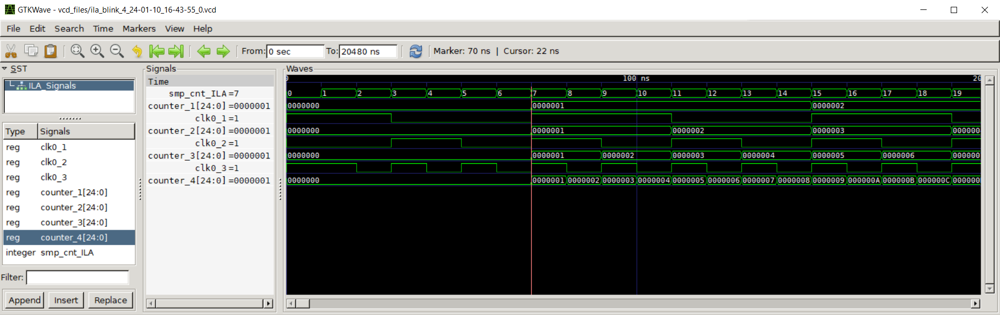
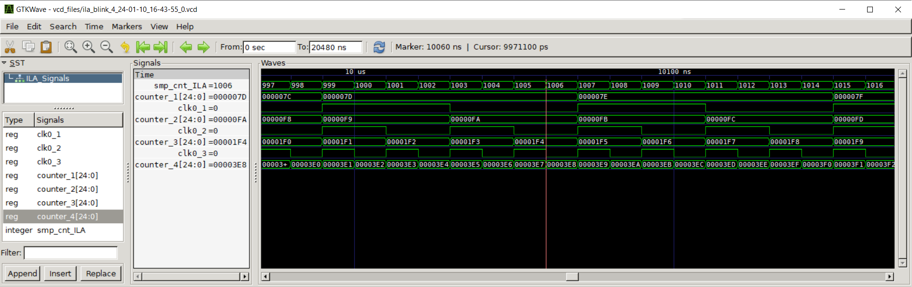

# GateMate ILA Test: Blink

The following document illustrates the test of the integrated logic analyser developed for the GateMate FPGA and the 'blink' design under test. The test was performed on an Evaluation Board V3.1B with a CCGM1A1.

The design instantiates four PLLs, with each output signal synchronously incrementing a 25-bit register. The highest-order bits of these registers are connected to an LED.

PLL frequencys:

PLL 1:  12.5 MHz
PLL 2:  25.0 MHz 
PLL 3:  50.0 MHz
PLL 4: 100.0 MHz

## ILA Configuration

This ILA configuration example demonstrates that the ILA can be effectively clocked with one of the design under test's frequencies, when all four nets of the global mesh on the A1 are occupied.

The output of the interactive shell can be found in the file [example_output/output_ILACOP_blink_4.](example_output/output_ILACOP_blink_4)

The 100 MHz output signal of the PLL 4 was selected as the clock signal for the ILA.

The signal connected to the output signal of the CC_USR_RSTN primitive was selected to control the reset signal of the DUT from the ILA.

The remaining configurations were made as follows:

- Number of selected bits to be analysed: 103
- Signals under test: 
    1. **counter_1** [24:0]  
        Counter that is incremented with the 12.5 MHz clock.
    2. **counter_2** [24:0]  
        Counter that is incremented with the 25.0 MHz clock.
    3. **counter_3** [24:0]  
        Counter that is incremented with the 50.0 MHz clock.
    4. **counter_4** [24:0]  
        Counter that is incremented with the 100.0 MHz clock.
    5. **clk0_1**
        12.5 MHz clock signal from PLL 1.
    6. **clk0_2**
        25.0 MHz clock signal from PLL 2.
    7. **clk0_3**
        50.0 MHz clock signal from PLL 3.

- Capture duration before Trigger: Sample count = 1015, Capture duration = 10.15 us
- Capture duration after Trigger: Sample count = 1033, Capture duration = 10.33 us

As a trigger, a pattern was set across the lowest 12 bits of counter_4. The pattern was hex 0x3E8, equivalent to 1000 in decimal.

Then the DUT was hold in reset until the capture was started. 

## Generated waveform and outcome

In the **waveform start** screenshot, it is evident that the first 6 recorded samples are zero, indicating that the DUT was still in reset at that time.

At sample 1006 in screenshot **waveform trigger**, which is 1000 samples later, it can be seen that the trigger was activated because counter_4, which increments at the same frequency as the ILA samples, has reached the value of 1000 (hex 3e8).

## Utilization Report 

 CPEs                   1697 /  20480  (  8.3 %)
 -----------------------------------------------
   CPE Registers         932 /  40960  (  2.3 %)
     Flip-flops          932
     Latches               0

 Block RAMs              7.0 /     32  ( 21.9 %)
 -----------------------------------------------
   BRAM_20K                3 /     64  (  4.7 %)
   BRAM_40K                4 /     32  ( 12.5 %)

 PLLs                      4 /      4  (100.0 %)
 GLBs                      4 /      4  (100.0 %)
 SerDes                    0 /      1  (  0.0 %)
 USR_RSTN                  1 /      1  (100.0 %)

