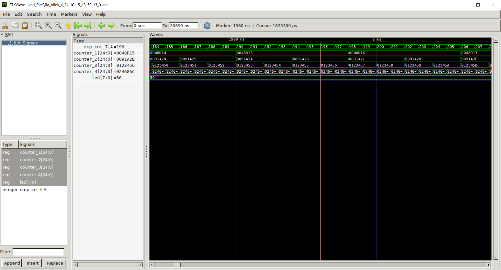

# GateMate ILA Test: Blink

The following document illustrates the test of the integrated logic analyser developed for the GateMate FPGA and the 'blink' design under test. The test was performed on an Evaluation Board V3.1B with a CCGM1A1.

The design instantiates four PLLs, with each output signal synchronously incrementing a 25-bit register. The highest-order bits of these registers are connected to an LED.

PLL frequencys:

PLL 1:  12.5 MHz
PLL 2:  25.0 MHz 
PLL 3:  50.0 MHz
PLL 4: 100.0 MHz

## ILA Configuration

This ILA configuration example demonstrates that the ILA can be effectively clocked with one of the design under test's frequencies, when all four nets of the global mesh on the A1 are occupied.

The output of the interactive shell can be found in the file [example_output/output_ILACOP_blink_4.](example_output/output_ILACOP_blink_4)

The 100 MHz output signal of the PLL 4 was selected as the clock signal for the ILA.

The signal connected to the output signal of the CC_USR_RSTN primitive was selected to control the reset signal of the DUT from the ILA.

The remaining configurations were made as follows:

- Number of selected bits to be analysed: 103
- Signals under test: 
    1. **counter_1** [24:0]  
        Counter that is incremented with the 12.5 MHz clock.
    2. **counter_2** [24:0]  
        Counter that is incremented with the 25.0 MHz clock.
    3. **counter_3** [29:0]  
        Counter that is incremented with the 50.0 MHz clock.
    4. **counter_4** [29:0]  
        Counter that is incremented with the 100.0 MHz clock.
    5. **clk0_1**
        12.5 MHz clock signal from PLL 1.
    6. **clk0_2**
        25.0 MHz clock signal from PLL 2.
    7. **clk0_3**
        50.0 MHz clock signal from PLL 3.

## Generated waveform and outcome

## Utilization Report

 CPEs                   1843 /  20480  (  9.0 %)
 -----------------------------------------------
   CPE Registers        1146 /  40960  (  2.8 %)
     Flip-flops         1146
     Latches               0

 GPIOs                    13 /    162  (  8.0 %)
 -----------------------------------------------
   Single-ended           13 /    162  (  8.0 %)
     IBF                   4
     OBF                   9
     TOBF                  0
     IOBF                  0
   LVDS pairs              0 /     81  (  0.0 %)
     IBF                   0
     OBF                   0
     TOBF                  0
     IOBF                  0

 GPIO Registers            0 /    324  (  0.0 %)
 -----------------------------------------------
   FF_IBF                  0
   FF_OBF                  0
   IDDR                    0
   ODDR                    0

 Block RAMs              9.0 /     32  ( 28.1 %)
 -----------------------------------------------
   BRAM_20K                0 /     64  (  0.0 %)
   BRAM_40K                0 /     32  (  0.0 %)
   FIFO_40K                9 /     32  ( 28.1 %)

 PLLs                      4 /      4  (100.0 %)
 GLBs                      4 /      4  (100.0 %)
 SerDes                    0 /      1  (  0.0 %)
 USR_RSTN                  1 /      1  (100.0 %)
