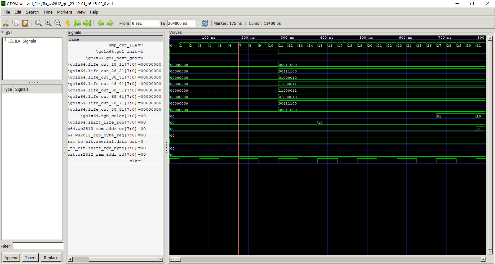
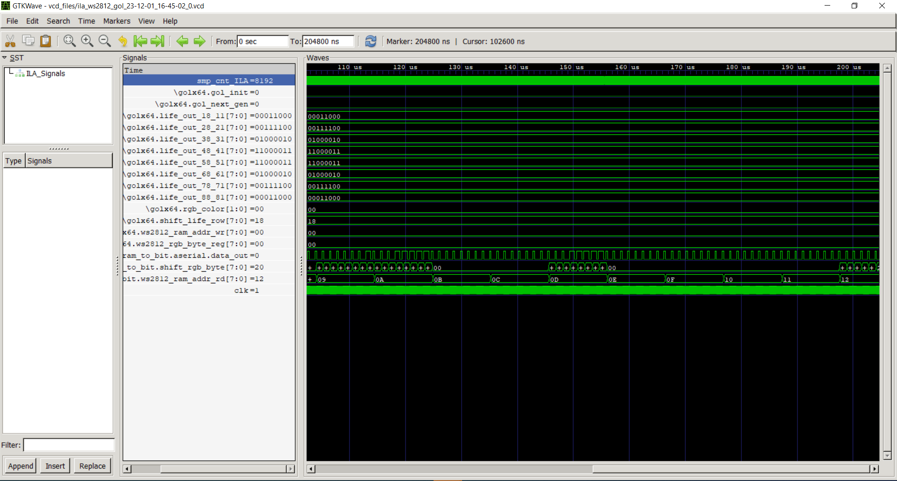

# GateMate ILA Test: GoLx64 to ws2812 8x8

The following document illustrates the test of the integrated logic analyser and the design under test 'GoLx64 to ws2812 8x8' developed for the GateMate FPGA. The test was performed on an Evaluation Board V3.1B with a CCGM1A1.

The design under test implements an 8x8 matrix consisting of 64 cells that simulate the 'Conway's Game of Life'. Each cell has eight neighbours and implements the typical rules of the game. 

These are as follows:
1. A 'dead' (0) cell becomes 'alive' (1) if it has exactly three living neighbours. 
2. A living cell remains alive if it has exactly two or exactly three living neighbours. 
3. If a living cell has more than three or less than two living neighbours, it changes to the dead state.

To visualise the state of the 'Game of Life' matrix, an 8x8 ws2812 matrix is connected to the evaluation board. This receives the three bytes of the RGB value for each of the 64 LEDs in sequence via a serial data line

For this purpose, the states of the 8x8 'Game of Life' matrix, with one RGB value for the 'dead' state (0) and one RGB value for the 'alive' state (1), are written to a dual-port RAM. This RAM is read out by another process, serialised and then output in the sequence typical for WS2812.

## ILA Configuration

The output of the interactive shell can be found in the file [example_output/ILA_ws2812_gol_terminal_out.](example_output/ILA_ws2812_gol_terminal_out)

The ILA was configured as follows:

- Number of selected bits to be analysed: 	110
- Signals under test:
    1. **clk**  
        External clock source of 10 MHz.  
    2. **gol_init**  
        This signal is used to initialise the GoL matrix with a given pattern.
    3. **gol_next_gen**  
        Gives the command to calculate the next generation.
    4. **life_out** [88:81], [78:71], [68:61], [58:51], [48:41], [38:31], [28:21], [18:11]  
        The states of GoL cells are stored in this matrix. Each cell gets its neighbors from this matrix. Each cell has 8 neighbors, so the cells at the edge have no active neighbors. However, these must be connected and kept permanently at logic '0' to ensure a correct function. The 10x10 array life_out is at the edge, i.e. [0][0-8],[0-8][9], [9][1-9], [1-9][0] constantly '0' while the inner 8x8 matrix is connected to the outputs of the gol cells. in the analysis only the inner 8x8 matrix is to be analyzed.
    5. **rgb_color** [1:0]  
        When writing the RGB value to RAM, this signal indicates whether the byte for red, green or blue is to be written.
    6. **shift_life_row** [7:0]  
        This register is initiated when converting the 8x8 GoL matrix into the corresponding RGB values with one line of the outputs of the GoL matrix. The top bit is always evaluated next and the register is then shifted one position to the left. This is carried out for all eight lines.   
    7. **ws2812_ram_addr_wr** [7:0]  
        Address to which the current RGB byte is written.
    8. **ws2812_rgb_byte_reg** [7:0]  
        RGB byte that is written to the RAM. 
    9. **shift_rgb_byte** [7:0]  
        This register is initialized with the byte currently read from RAM. The top bit of the register is then transferred serially according to the characteristic typical for ws2812 and the register is then shifted one position to the left.
    10. **ws2812_ram_addr_rd** [7:0]  
        Address of the currently read byte.
    11. **data_out**  
        Serial data line for the WS2812 matrix.

- Sampling frequency: 40 MHz
- Capture duration before Trigger: Sample count = 8, Capture duration = 0.2 us
- Capture duration after Trigger: Sample count = 8184, Capture duration = 204.06 us

## Generated waveform and images of the hardware

The DUT was hold in reset-state with the function: "reset DUT (hold the DUT in reset until the capture starts)" until the capture starts. The initial pattern shown there is an oscillating object that has 5 different cycles.

Six trigger sequences were set. The first sequence has the trigger "rising edge " on the signal "\golx64.gol_init" and the following sequences all have the trigger "rising edge" on "\golx64.gol_next_gen".

### Sequence 1

The image shows the initial state of the RGB LED matrix.

The first capture image clearly shows how the matrix is initialised with the corresponding pattern. The vectors that represent 'life_out' are shown in binary representation to make it easier to recognise the pattern. After initialisation, it can be seen that 'shift_life_row' is initialised with the first row and the data is prepared for the WS2812 matrix.

In the further course of the waveform, you can see how the output bits of the GoL cells are converted into the corresponding RGB values and written into the RAM.

The last part of the waveform shows how the rgb values are read from the RAM and transmitted serially to the output for the LED matrix in the sequence typical for ws2812.

The following sequences show how the trigger is triggered after a risingedge for next_gen and how the next generation is calculated.

### Sequence 2

### Sequence 3

### Sequence 4

### Sequence 5

